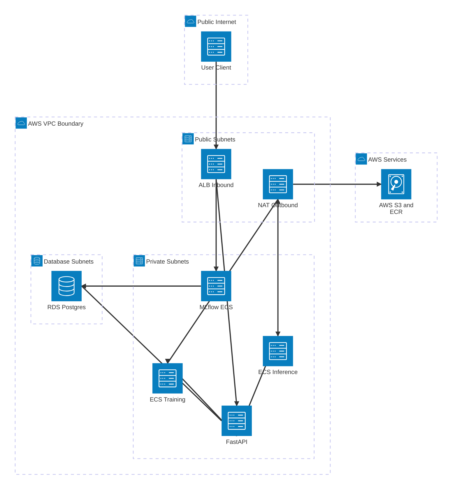

# The API Boundary: Enterprise Networking and Stateful ML Orchestration

In v1, triggering a training run meant modifying AWS primitives via the CLI. To scale to a multi-model catalog, we need a standardized communication protocol (a CQRS API) and stateful orchestration (RDS/Alembic) to track models. But an API is only a suggestion until network isolation (NAT/ALB) enforces it by making the underlying compute invisible to the public internet. This post bridges the gap between ML scripts and enterprise software.

---

## The Transition from Scripts to Systems

Scaling a platform exposes the structural limits of version one. When a platform only handles a single model, configuration can live in CDK scripts, and training can be triggered by a developer running an AWS CLI command. 

The moment you introduce a second model, that pattern collapses. A collection of scripts is a dead end. Data scientists should not need IAM console access to test a new algorithm, nor should they need to write CDK deployment code to schedule inference runs. To decouple the data scientist from the underlying ECS infrastructure, the system requires a strict REST API that acts as an orchestration boundary.

## System Architecture: The Model Catalog

To orchestrate multiple models, I introduced a catalog database behind a FastAPI application, completely isolating the data plane and the Fargate compute from the public internet.

Before jumping into implementation details, we need to examine how the platform's networking is structured to guarantee security and isolation. The architecture is defined by three distinct traffic flows:

1. **The Inbound Route (The Application Load Balancer)**: When a client makes an HTTP request to the API, they are communicating from the Public Internet. The Fargate tasks (FastAPI and MLflow) live inside Private Subnets, meaning they do not possess public IP addresses and cannot be reached directly. To bridge this gap, an Application Load Balancer (ALB) is placed in the Public Subnet. The ALB acts as the front door: it receives the traffic and forwards the request securely into the Private Subnet.
2. **The Outbound Route (The NAT Gateway)**: Because the ECS Fargate tasks are deployed in Private Subnets, they are trapped. When a container boots up, it must reach out to the internet to download its Docker image from AWS ECR or fetch Python dependencies. To solve this, a NAT Gateway sits in the Public Subnet. When the trapped containers need external data, they send outbound requests to the NAT Gateway. The NAT Gateway acts as an escape hatch to fetch the data and return it. External users never interact with the NAT Gateway.
3. **The Stateful Data Plane (RDS Postgres)**: The relational database lives deep inside the VPC in its own isolated Database Subnets. It is entirely cut off from the internet and the Public Subnets. The only entities permitted to communicate with the database are the internal FastAPI and MLflow containers.

## Subsystem Implementations and Key Architectural Decisions

### 1. Network Hardening (ALB + NAT Gateway)

An API boundary is meaningless if developers can bypass it. In version one, the ECS Fargate containers required public IPs to pull Docker images from ECR and reach the MLflow server. 

Public IPs on compute instances processing customer data are an unacceptable security risk in enterprise environments. I could have deferred network hardening to v3 to maintain development speed, but that creates massive technical debt. Instead, I took the hit on speed and refactored the CDK infrastructure to place all Fargate tasks in `PRIVATE_WITH_EGRESS` subnets.

This required two networking additions:
1.  **Application Load Balancer (ALB)**: Placed in the public subnet to route incoming external API requests to the private FastAPI containers.
2.  **NAT Gateway**: Placed in the public subnet to allow private containers to reach out to the internet (to pull ECR images and pip packages) without exposing them to incoming internet traffic.

With this topology, the underlying compute is mathematically invisible to the public internet. The API is no longer a suggestion; it is the only physical route into the platform.

### 2. The FastAPI Boundary (CQRS)

A platform API handles two completely different traffic profiles. Checking if a model is registered takes single-digit milliseconds. Launching a Fargate training task takes minutes to provision and run. 

To handle this cleanly, I implemented Command Query Responsibility Segregation (CQRS) in the FastAPI boundary. The alternative was a Monolithic Service Class, which inevitably swells into a 1000-line "God class" with a gigantic `__init__` method. By separating the API into commands (state-mutating asynchronous triggers) and queries (read-only synchronous lookups), the business logic remains highly cohesive and testable. 

I chose FastAPI over Django or Flask because Django's synchronous ORM fights our async architecture, and Flask lacks native Pydantic validation. FastAPI's native `async/await` ensures that heavy API calls (like writing task execution commands to ECS) do not block the web server.

### 3. State Management (Alembic & SQLModel)

Orchestrating multiple models requires state. You must track which models exist, what their hyperparameters are, and which schedules they run on. 

Hardcoding this into a CDK configuration array requires a full infrastructure deployment just to onboard a new model variant. To solve this, I introduced a relational model catalog using a `db.t4g.micro` RDS Postgres instance. 

The database schema is defined using SQLModel, providing strict typing that integrates natively with FastAPI. To manage schema evolution safely in a production environment, I implemented Alembic for asynchronous migrations. This guarantees that as the catalog schema expands to track new metadata (like drift detection thresholds or SLA tiers), the database transitions deterministically without manual SQL execution.

### 4. Observability: Structured Logging & Domain Exceptions

Raising generic `HTTPException(status_code=500)` inside route handlers scatters web logic throughout the domain. When a Fargate task fails silently, standard string logs make tracing impossible.

By combining JSON-structured logging (which CloudWatch parses natively) with strict Domain Exceptions (e.g., `ModelNotFoundError`), we guarantee that every error traces back to a specific domain operation rather than a generic web framework crash. A global FastAPI exception handler intercepts these domain exceptions and maps them to standard JSON error responses. This provides predictable error payloads for API clients and traces that operators can actually debug.

---

## Key Takeaways: From Scripts to Enterprise APIs

The table below summarizes the architectural pivot from hardcoded infrastructure to dynamic API orchestration:

| Component | Single-Model Paradigm | API-Driven Paradigm | Structural Benefit |
| :--- | :--- | :--- | :--- |
| **Compute Networking** | Public Subnets + IGW | Private Subnets + NAT/ALB | Workloads handling customer data are physically isolated from incoming internet traffic. |
| **API Execution** | Monolithic Service Class | CQRS (Commands/Queries) | Heavy orchestration triggers never block rapid read queries. |
| **State Management** | Hardcoded CDK Configs | SQLModel + Alembic | Zero-downtime schema evolution and dynamic model registration. |
| **Observability** | String Logs & HTTP 500s | JSON Logs & Domain Exceptions | Errors trace back to specific domain operations, parsed natively by CloudWatch. |

---

## The Ugly Part: RDS Race Conditions and Alembic Collisions

Infrastructure code is clean; production is messy. To save on AWS costs, I provisioned a single `db.t4g.micro` RDS instance to serve as the backend for *both* the MLflow Tracking Server and the new FastAPI Model Catalog. 

Both tools use SQLAlchemy and Alembic behind the scenes. When the API container booted up in Fargate, the `alembic upgrade head` command crashed. It collided with the `alembic_version` table that MLflow automatically creates when it initializes. Because both tools were trying to manage their respective schema versions using the default table name, the migrations deadlocked and corrupted the state.

Fixing this required two mechanical changes:
1.  **Isolated Version Tables**: I customized the `env.py` script for the API's Alembic migrations. By injecting `version_table="api_alembic_version"`, I isolated the API's migration history from MLflow's history.
2.  **Deterministic Boot Sequence**: I created an `entrypoint.sh` script for the Docker container. This forces the container to run `alembic upgrade head` synchronously *before* executing `uvicorn`, guaranteeing the API schema exists before any traffic is served.

Because the initial race condition corrupted the RDS schema state (MLflow created tables while the API was crashing), I had to run `cdk destroy` and completely redeploy the infrastructure to untangle the database and validate the fix.

---

## Where We Go Next

Part 3 of this series tackles the final bottleneck of multi-model orchestration: the developer loop. We will examine how to drop deployment iterations from 15 minutes to 3 seconds using local Docker Compose mocking, and how to abstract the training scripts using a strict `BaseMLModel` OOP protocol to enable dynamic multi-model dispatch.

### Join the Conversation

If you are building production ML platforms, or navigating the jump from single-model scripts to secure multi-model APIs, let's connect.

*When building ML platforms, do you prefer opinionated architectures with strict boundaries (CQRS APIs, private subnets, NAT/ALBs), or do you favor the speed and flexibility of monolithic designs with relaxed network security?* 

Share your trade-offs in the comments below or reach out directly on [LinkedIn](https://linkedin.com/in/danivpv).

---

*Daniel Ivan Parra Verde is an ML Engineer specializing in production AI agents, distributed systems, and ML platforms.*

*[GitHub](https://github.com/danivpv) · [LinkedIn](https://linkedin.com/in/danivpv)*

---

### Appendix: Source Code & References

The complete source code, CDK infrastructure, and commit-locked rationale behind every trade-off discussed in this post reside in the official repository:
- **Source Code (`commit 50fd79e`)**: [github.com/danivpv/ml-platform](https://github.com/danivpv/ml-platform/tree/50fd79e5322cfe5b71ea14a95a9d1b166c47a379)
