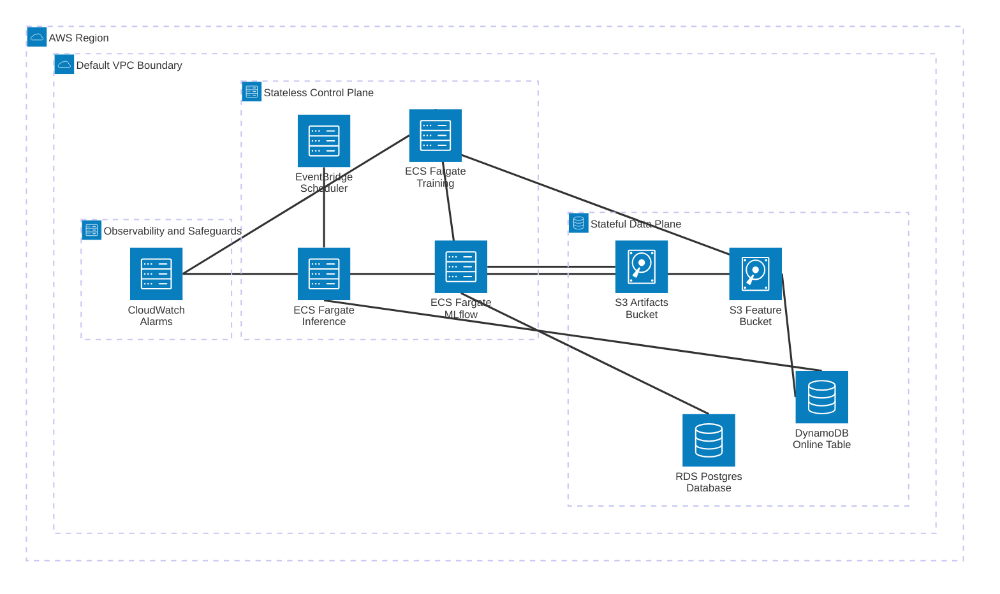

# What an ML Platform Actually Is and Why I Built One Instead of Certifying for One

Data scientists solve the last-mile problem. AI/ML/Data/Software engineers build the road. Most organizations get this stack wrong: either by not covering them all, or by siloing them so hard the systems never talk and ownership erodes to everyone and no one. This post is my attempt to understand what the ML platform engineer's piece actually looks like when built from scratch, grounded in 27 architectural decisions and hard-earned production lessons.

---

## The Question That Started It

A few years ago I was asked, at a previous job, to translate graph-based feature engineering into SQL for online serving. No feature store. No experiment tracking. No ability to reproduce the training environment. The task was technically possible. But without a system to keep offline and online feature logic synchronized, any result was structurally fragile: a time bomb with no visible fuse.

That experience crystallized something fundamental: the gap between a working notebook model and a reliable production ML service is not algorithms. It is operational infrastructure. It requires systems that make models reproducible, auditable, safely iterable, and cost-predictable. Most data scientists never see this operational layer directly because in mature setups it runs silently under the hood, while in enterprise environments managed platforms abstract it behind high recurring bills. When it is missing entirely, however, model operations become impossible to meet.

I wanted to build these systems from scratch. Not to compete with SageMaker, but to understand precisely what SageMaker is actually doing, how its boundaries operate, and how an engineering team designs systems to support operations and meet business demands.

---

## The Platform Architecture: Subsystems and Guarantees

Before jumping into implementation details, we need to examine how the platform is structured. An ML platform is not a single script or an ad-hoc dashboard; it is an integrated architecture composed of four distinct, and independent subsystems engineered to eliminate training-serving skew, guarantee reproducibility, decouple compute workloads, and maintain rigorous observability.



Each subsystem serves a specific operational purpose, backed by explicit engineering trade-offs:

1. **Feature Store Subsystem (Feast + S3 + DynamoDB)**: I built the feature store subsystem to provide unified offline and online feature serving using identical transformation logic. By reading historical Parquet files from S3 and enforcing point-in-time joins based on `event_timestamp`, I eliminated label leakage and provided complete data traceability for data scientists serving business stakeholders.
2. **Experiment & Lineage Subsystem (MLflow on ECS Fargate + RDS Postgres + S3)**: I built the MLflow server subsystem to track comprehensive dataset, parameter, and model artifact lineage, alongside frictionless A/B deployments. By promoting verified models via named aliases (`@champion`), inference tasks load the authoritative production model without requiring container redeployments or configuration edits.
3. **Decoupled Compute Subsystem (Training vs. Batch Inference Tasks)**: I built decoupled inference and training tasks so they evolve and scale independently. During scheduled serving, inference containers do not need to store training gradients or heavy autograd trees. This separation allows inference jobs to run on lean Fargate profiles optimized for latency SLAs while training jobs consume high-memory burst compute.
4. **Observability & Safeguard Subsystem (CloudWatch + IAM Boundaries)**: A model that fails silently destroys business trust. I monitored infrastructure health (`TaskCount`, memory utilization, and failure alarms) from day one, establishing the baseline needed to monitor model accuracy and data drift later. Furthermore, hard IAM policy boundaries guarantee that inference tasks can write only to designated prediction prefixes, preventing accidental data plane corruption.

Next, we will dive into how I implemented these core subsystems, the architectural trade-offs behind each decision, and four noteworthy/annoying AWS edge-case bugs discovered along the way. You can clone and check out the exact working implementation (`commit 4c60434`) directly from the [GitHub repository](https://github.com/danivpv/ml-platform/tree/4c6043475e7d2725b2d2a7d5a3e0eae669e125df):

```bash
git clone https://github.com/danivpv/ml-platform.git
cd ml-platform
git checkout 4c6043475e7d2725b2d2a7d5a3e0eae669e125df
```

---

## Subsystem Implementations and Key Architectural Decisions

### 1. Infrastructure as Code: The Two-Stack Deployment Boundary

The single most important architectural decision in the codebase is separating the application into two distinct AWS CDK stacks by deployment boundary rather than logical domain.

Here is how `app.py` instantiates and links the two stacks at the root level:

```python
# app.py: CDK entry point enforcing strict stateful vs. stateless stack separation
stateful = MLPlatformStatefulStack(
    app,
    "MLPlatformStateful",
    env=env,
    description="ML Platform: stateful data plane (S3, DynamoDB, RDS)",
)

stateless = MLPlatformStatelessStack(
    app,
    "MLPlatformStateless",
    stateful=stateful,
    env=env,
    description="ML Platform: compute and observability (Fargate, EventBridge, CloudWatch)",
)

# Explicit dependency: CloudFormation deploys and updates stateful before stateless
stateless.add_dependency(stateful)
```

Inside `component.py`, every parameter passed into the constructor directly serves the execution boundary: rather than performing runtime AWS API network queries or hardcoding brittle string ARNs (`arn:aws:s3:::...`), the stateless compute stack receives typed Python object references (`stateful: MLPlatformStatefulStack`) from the stateful data plane. By passing the actual construct instances (`stateful.feature_store.bucket`, `stateful.experiment_tracking.artifacts_bucket`), CDK automatically synthesizes deterministic CloudFormation cross-stack exports and imports. Furthermore, when the compute stack later grants read access (`bucket.grant_read(task_role)`), CDK binds least-privilege IAM policies to the exact synthesized bucket ARN without circular dependency errors or runtime lookup failures:

```python
# component.py: stateless stack consuming typed references from stateful data plane
class MLPlatformStatelessStack(Stack):
    def __init__(
        self,
        scope: Construct,
        construct_id: str,
        *,
        stateful: MLPlatformStatefulStack,
        **kwargs: Any,
    ) -> None:
        super().__init__(scope, construct_id, **kwargs)

        # Direct reference passing eliminates circular stack dependencies
        self.feature_bucket = stateful.feature_store.bucket
        self.online_table = stateful.feature_store.online_table
        self.artifacts_bucket = stateful.experiment_tracking.artifacts_bucket
```

Stateful resources (S3 buckets, DynamoDB table, RDS Postgres database) carry `RemovalPolicy.RETAIN`. The stateless control plane iterates freely: new Fargate task definitions, updated EventBridge schedules, modified CloudWatch dashboards. Because the stateless stack can be destroyed and redeployed completely from scratch without touching the underlying storage, I can iterate on the training container image or adjust memory limits without any risk of corrupting historical feature data or experiment tracking history. That guarantee is structural rather than a team convention. Conventions break under deadline pressure; CDK cross-stack separation does not.

This strict two-stack layout directly implements official AWS engineering best practices: structuring `app.py` as a modular Well-Architected Framework component, isolating persistent storage (`RemovalPolicy.RETAIN`) from stateless compute tiers, and passing typed Python construct references to resolve all least-privilege IAM policies at **synthesis time (`cdk synth`)** with zero runtime network traffic (detailed in [External References](#external-references-and-aws-cdk-best-practices) below).

---

### 2. Feature Store (Feast + DynamoDB): Solving Training-Serving Skew Structurally

To reliably answer the operational question *"What exact historical feature data and timestamp were involved in each serving?"*, the feature store cannot rely on ad-hoc queries or developer habit.

The most misunderstood aspect of Feast is the distinction between two core commands:

- **`feast apply`** writes schema definitions. It reads your Python feature definitions and writes a `registry.db` metadata snapshot to S3. No feature data moves during this step; it is strictly a schema migration.
- **`feast materialize`** writes feature data. It reads offline Parquet files from S3, filters for records up to the current timestamp, and writes the latest feature value per entity into DynamoDB.

These are two separate operations that most tutorials blur together. I designed the architecture around a dual-store pattern:

**Offline store (S3, Parquet)**: High-throughput batch reads over historical time series. The training container calls `get_historical_features()` with an `entity_df` containing an `event_timestamp` per entity. Feast performs a point-in-time join, returning only features that existed at or before that exact timestamp. This provides the structural fix for label leakage during model training.

**Online store (DynamoDB, PAY_PER_REQUEST)**: Single-digit millisecond key-value lookups for inference. On-demand billing means the table costs literally $0.00 at idle. Unlike Redis, which bills an active instance continuously regardless of traffic, DynamoDB charges purely per read/write request. At MVP scale, this trade-off saves tens of dollars per month while eliminating infrastructure maintenance.

Here is the exact feature view definition as registered in the repository:

```python
# feature_views.py: authoritative feature registration for online and offline stores
customer_features = FeatureView(
    name="customer_features",
    entities=[customer],
    ttl=timedelta(days=365),
    schema=[
        Field(name="age", dtype=Int64),
        Field(name="account_balance", dtype=Float64),
        Field(name="num_transactions", dtype=Int64),
        Field(name="days_since_last_txn", dtype=Int64),
    ],
    source=customer_features_source,
    online=True,  # Materializes latest values to DynamoDB via `feast materialize`
)
```

The `online=True` flag informs `feast materialize` that this view requires a DynamoDB partition entry. The `event_timestamp_column` on the underlying `FileSource` enables point-in-time joins. Neither setting is optional: removing either breaks the operational contract between training and serving.

One crucial clarification: Feast is deliberately not a transformation compute engine. Feature engineering (Pandas transformations, SQL queries, Spark jobs) executes before Feast runs and writes clean Parquet files to S3. Feast registers schemas and performs time-travel joins across those files; it does not rerun raw transformations. I selected Feast to solve the training-serving skew structurally right at the storage and retrieval layer, rather than relying on developer discipline, manual coordination across teams, or individual engineering habit.

---

### 3. Experiment & Lineage Tracking (MLflow + RDS): Reproducing Production Errors

To reliably answer the operational question *"What exact production model, parameter set, and historical training dataset were used to optimize and validate this deployment?"*, experiment tracking and model promotion must be structurally tied to artifact storage.

MLflow is not simply a place where you log metrics. That framing undersells its core architectural value by two critical jobs.

In this platform, MLflow acts as the source of truth for three distinct requirements: **experiment lineage** (recording exact runs, hyperparameters, datasets, and output artifacts), **artifact storage** (storing serialized models in S3 while tracking their URIs in database metadata), and **model registry with alias promotion** (using the `@champion` alias as an atomic production pointer).

Here is how alias promotion is executed inside `train.py` after model evaluation:

```python
# train.py: champion alias promotion after successful evaluation
client = MlflowClient()
client.set_registered_model_alias(
    name=MODEL_NAME,       # "ml-platform-churn"
    alias=CHAMPION_ALIAS,  # "champion"
    version=version,
)
champion_uri = f"models:/{MODEL_NAME}@{CHAMPION_ALIAS}"
```

The scheduled inference container loads the active model using one clean API call:

```python
# predict.py: loading production model via alias without knowing underlying framework
mlflow.pyfunc.load_model("models:/ml-platform-churn@champion")
```

The inference service does not need to know whether the champion model is a random forest, a gradient booster, or a neural network. The `pyfunc` interface provides a standardized execution abstraction. The `@champion` alias serves as a dynamic production pointer that can be reassigned atomically via `set_registered_model_alias` without redeploying a single container or modifying environment variables.

Most importantly, the synergy between the feature store and experiment tracking establishes a complete operational feedback loop: Feast enables a data scientist to query the exact historical feature vector (`event_timestamp` point-in-time state) involved in a production serving error reported by operations, while MLflow enables them to pull the authoritative model artifact (`@champion`), hyperparameter set, and training dataset snapshot used to build that exact model. By combining the production feature state from Feast with the model lineage from MLflow inside a local test harness, data scientists can reproduce production errors deterministically and ship verified fixes. Bridging operational debugging back to reproducible experimentation is the entire point of the platform.

The backend database selection also reflects explicit cost mechanics. I chose a `db.t4g.micro` RDS Postgres instance rather than Aurora Serverless v2. Aurora Serverless v2 lacks a true zero floor because its minimum capacity (`0.5 ACU`) runs and bills continuously. At low baseline volumes, that minimum floor makes Aurora Serverless v2 significantly more expensive than a fixed micro instance. Aurora's marketing claims are correct regarding rapid scaling under load, but incorrect regarding cost efficiency when baseline traffic is near zero.

---

### 4. Decoupled Compute Profiles: Training vs. Batch Inference Isolation

Collapsing training and inference into a single container image or shared execution environment is a common anti-pattern. While convenient during initial prototyping, shared compute profiles introduce immediate operational hazards once deployed:

1. **Resource Allocation and Cost Profiles**: Model training is computationally bursty, requiring high memory allocation and CPU burst capacity to process historical batches, construct decision trees, and evaluate validation metrics. In contrast, batch inference operates under strict execution windows (`InferenceScheduleArn` managed by EventBridge Scheduler) and requires minimal memory to load serialized weights and score input records. Running inference on heavy training instances wastes compute budget; running training on lean inference instances triggers out-of-memory crashes.
2. **Dependency Isolation and Image Footprint**: Training pipelines depend on heavy optimization libraries, data validation suites, and training orchestration SDKs. Inference services require only minimal serving runtimes (`mlflow.pyfunc`), fast database connectors (`boto3` for DynamoDB), and core numerical packages. By isolating `self.training.task_definition` from `self.inference.task_definition` in CDK, I reduced the inference container image footprint, accelerated task startup times during scheduled triggers, and minimized the security surface area.
3. **Independent Lifecycle Evolution**: When data scientists experiment with new training frameworks or upgrade machine learning dependencies, the inference serving pipeline remains completely untouched. Production scoring runs reliably on stable container definitions while the training task iterates rapidly in parallel.

---

### 5. Infrastructure Observability and Hardened IAM Safeguards

A platform without observability is blind to silent failures. I treated infrastructure monitoring and IAM boundary defense as core engineering prerequisites right now, establishing the operational baseline required before adding complex model quality alerts later:

1. **CloudWatch Dashboard and Alarm Automation**: My CDK architecture provisions an automated `MonitoringConstruct` that generates a consolidated CloudWatch dashboard (`MLPlatform-Infra-Health`) alongside proactive alarms:

- **Fargate Task Health (`TaskCount` and Exit Status)**: Monitors active instances of the MLflow tracking service and alerts on unexpected task exits across both training and batch inference executions.
- **Database Connection Tracking**: Tracks active connections on the `db.t4g.micro` RDS instance to detect connection leaks or exhaustion from container retries.
- **Automated SNS Escalation**: When any metric crosses critical thresholds, CloudWatch triggers an automated Simple Notification Service (`SNS`) topic that alerts engineering leads (`ALARM_EMAIL`) immediately, ensuring infrastructure anomalies are caught before morning business hours.

2. **Hardened IAM Container Security Boundaries**: In my multi-stage Docker builds, Stage 2 runtime images copy only the compiled virtual environment (`.venv/`) from Stage 1. They do not copy the source tree (`src/`). Runtime scripts execute strictly via console scripts installed during the `uv sync` build step. As a direct consequence, scratch scripts, private notes, local configuration files, and root-level utilities cannot reach ECR or production containers.

Furthermore, the inference task role is strictly scoped using explicit CDK policy statements right in `component.py`:

```python
# component.py: restricting inference task permissions to specific prediction prefixes
cast(iam.Role, self.inference.task_definition.task_role).add_to_policy(
    iam.PolicyStatement(
        sid="InferencePredictionsWrite",
        actions=["s3:PutObject"],
        resources=[
            feature_bucket.arn_for_objects("predictions/*"),
        ],
    )
)
```

The inference task can read feature data to construct inference vectors, and it can write batch outputs strictly to the `predictions/*` prefix. It cannot overwrite raw Parquet feature tables, nor can it delete historical records. That `PutObject` boundary is enforced by IAM policy rather than developer trust.

---

## Key Takeaways: Operations Enabled by Subsystem

The table below summarizes the four core operational questions the platform must answer, the technology stack chosen for each, and the structural architectural guarantees that ensure those answers remain accurate under production conditions:

| Subsystem | Core Operational Question Answered | Technology & Architecture | Structural Guarantee |
| :--- | :--- | :--- | :--- |
| **Feature Store** | *What exact historical feature data and timestamp produced this serving?* | Feast, S3 (Parquet Offline), DynamoDB (`PAY_PER_REQUEST` Online) | Point-in-time joins (`event_timestamp`) eliminate training-serving skew and label leakage directly at the storage and retrieval layer. |
| **Experiment Lineage** | *What exact model artifact, parameter set, and training data produced this prediction?* | MLflow (`mlflow.pyfunc`), RDS Postgres (`db.t4g.micro`), S3 Artifacts | Atomic `@champion` alias promotion and immutable artifact tracking bridge production errors directly back to local reproduction. |
| **Decoupled Compute** | *How do latency SLAs hold under load without wasting compute budget?* | AWS ECS Fargate, EventBridge Scheduler (`InferenceScheduleArn`) | Independent task definitions isolate bursty memory autograd trees (`train.py`) from lean, scheduled inference containers (`predict.py`). |
| **Infrastructure & IaC** | *How do we iterate rapidly on compute definitions without risking data loss or orphaned resources?* | AWS CDK Python (`Stateful` vs. `Stateless` Stack Boundary) | Least-privilege IAM policies (`predictions/*` write limit) and `RemovalPolicy.RETAIN` guarantee data plane survival across complete compute rebuilds. |

---

## Architectural Trade-Offs: Cost Mechanics and Cold-Start Realities

An engineering decision log is not bureaucratic paperwork; it is the core architectural argument. The distinction between a platform engineer and an engineer who simply uses tools lies in whether you can explain every trade-off in exact cost and performance terms, and identify what you would modify if constraints shifted. 

The project requirement document inside the [repository](https://github.com/danivpv/ml-platform/tree/4c6043475e7d2725b2d2a7d5a3e0eae669e125df) contains a [27-entry architectural decision log](https://github.com/danivpv/ml-platform/blob/4c6043475e7d2725b2d2a7d5a3e0eae669e125df/docs/ml-platform-prd.md#2-architectural-decision-log) justifying every design choice against concrete constraints:

- **DynamoDB `PAY_PER_REQUEST` over Redis**: Yields literally zero cost at idle while serializing composite entity keys (`customer#1004`) into a single partition key, serving all future models without requiring schema migrations or continuous node costs.
- **NAT Gateway deferred**: Avoids ~$32/month in fixed hourly charges for private subnets that our S3 and DynamoDB API endpoints do not require.
- **No Application Load Balancer (`ALB`) in v1**: Avoids ~$16/month in fixed load balancer costs; IP-restricted security groups accessing ECS Fargate tasks directly suffice for v1 operations.
- **EventBridge Scheduler over classic EventBridge Rules**: Provides native Fargate network configuration directly inside a single resource definition without complex implicit IAM wiring.

Furthermore, physical infrastructure realities dictate task orchestration. My deployment logs show total training job execution times ranging from 2 to 3 minutes, yet the `scikit-learn` script operating over 200 synthetic entities completes its mathematical computation in approximately 10 seconds. The remaining ~2 minutes represent Fargate container cold-start overhead: hypervisor allocation, elastic network interface (`ENI`) attachment (~40 seconds), ECR container image pulling (~40 seconds), and Python interpreter initialization. This initialization delay dwarfs computation time at small dataset volumes. The goal of platform engineering is not eliminating cold-start overhead blindly, but designing decoupled workflows (`self.training` vs `self.inference`) that operate reliably within known infrastructure parameters.

---

## Production Realities: Four Bugs That Tested the System

Even with strict upfront design rigor, production cloud deployments reveal subtle edge cases. My [project deployment log documents 11 real bugs](https://github.com/danivpv/ml-platform/blob/4c6043475e7d2725b2d2a7d5a3e0eae669e125df/docs/ml-platform-prd.md#3-bug-and-resolution-log), labeled A through K. Rather than skipping straight to the "happy path," examining real AWS infrastructure edge cases reveals how the platform behaves under real-world constraints.

Here is a summary of four particularly tricky technical investigations encountered during deployment:

| Bug ID & Title | Symptom Reported | Root Cause | Structural Fix |
| :--- | :--- | :--- | :--- |
| **Bug A: Moved Shebang** | Container crash (`sh: 1: exec: mlflow: not found`, Exit 127) | Multi-stage Docker copy invalidated hardcoded console script shebang (`#!/build/.venv/...`). | Aligned `WORKDIR /app` across build stages or invoked console utilities via `python -m mlflow`. |
| **Bug F: YAML Apostrophe** | `feast apply` failed (`Invalid bucket name "${feature_bucket}"`) | Unmatched single quote in a YAML comment suppressed Python's `os.path.expandvars()` environment variable substitution. | Removed single quotes and contractions from YAML files and comments to guarantee clean variable expansion. |
| **Bug K: IGW Hairpinning** | Intra-VPC HTTP connection timeouts to MLflow server | Connecting via public IP forced traffic through the Internet Gateway (`IGW`), stripping internal security group metadata. | Stored internal private IP in AWS Systems Manager (`SSM`) Parameter Store for all intra-VPC container communication. |
| **Bug L: Tag Propagation Lock** | `feast apply` immediately after CDK deploy failed (`LimitExceededException`) | CloudFormation applies DynamoDB resource tags asynchronously across partitions after `CREATE_COMPLETE`, rejecting concurrent `TagResource` calls. | Added a mandatory 30–60 second cooldown delay between initial `cdk deploy` and `feast apply`. |

Below are the detailed engineering investigations for each:

### Bug A: Exit 127 and the Moved Shebang

**Symptom**: The ECS container crashed immediately upon launch. CloudWatch logs reported `sh: 1: exec: mlflow: not found` with exit code 127.

**What happened**: I used a multi-stage Docker build where Stage 1 installed our virtual environment inside `WORKDIR /build`. Stage 2 copied `/build/.venv/` across to `/app/.venv/`. The console script `/app/.venv/bin/mlflow` contained a hardcoded shebang line generated during installation: `#!/build/.venv/bin/python`. Because `/build/.venv/` did not exist in Stage 2, the Linux kernel returned `ENOENT`, which the shell reported to CloudWatch as `not found`.

**The fix**: Align the `WORKDIR` paths exactly between stages (`/app`), or invoke console utilities via `python -m mlflow` to bypass shebang paths entirely.

**What it reveals**: Container packaging is a strict filesystem path contract. Shebangs are baked into console scripts at installation time. If you move a virtual environment directory between build stages, you break every script inside it. Identifying and fixing this costs a full deploy-debug-redeploy cycle (roughly 15 minutes on Fargate) each time.

### Bug F: The YAML Apostrophe

**Symptom**: Running `feast apply` failed immediately with `botocore.exceptions.ParamValidationError: Invalid bucket name "${feature_bucket}"`.

**What happened**: Feast initializes its repository settings by calling Python's `os.path.expandvars()` on the raw string content of `feature_store.yaml`. A YAML comment line contained an unmatched single quote (`# Feast's file provider reads Parquet`). Python's variable expansion logic treats all characters following an unmatched single quote as being inside an open literal string, where environment variable expansion (`${VAR}`) is suppressed. Consequently, `${FEATURE_BUCKET}` remained literal text. When passed to AWS, `boto3` converted the string to lowercase (`${feature_bucket}`) and rejected it as an invalid bucket name.

**The fix**: Remove all single quotes and contractions from YAML files and their comments, ensuring clean variable expansion.

**What it reveals**: Standard library functions like `os.path.expandvars()` behave unexpectedly when applied to entire YAML files. A single-character typo inside an innocuous comment broke the entire feature store registration pipeline, throwing an error message three layers of indirection away from the root cause.

### Bug K: IGW Hairpinning on Public IPs

**Symptom**: The training container logged repeated connection timeouts while attempting to reach the MLflow tracking server over HTTP, exhausting retries and failing the task.

**What happened**: Containers inside the VPC that connected to MLflow using its public IP routed traffic out through the Internet Gateway (`IGW`). The return path stripped internal security group metadata. Although the MLflow security group explicitly allowed ingress from the training task security group (`self.training.task_sg`), traffic returning via the `IGW` appeared to originate from an external IP rather than the internal security group ID, causing AWS to drop the packets.

Here is how the security group rule is explicitly wired in `component.py` within the stateless stack:

```python
# component.py: security group wiring avoiding cyclic cross-stack references
ec2.CfnSecurityGroupIngress(
    self,
    "MlflowIngressFromTraining",
    group_id=mlflow_sg.security_group_id,
    source_security_group_id=self.training.task_sg.security_group_id,
    ip_protocol="tcp",
    from_port=constants.MLFLOW_IMAGE_PORT,
    to_port=constants.MLFLOW_IMAGE_PORT,
    description="MLflow API ingress from training task",
)
```

**The fix**: Store the MLflow server's internal private IP inside AWS Systems Manager (`SSM`) Parameter Store during cluster initialization and read it inside containers for all intra-VPC communication.

**What it reveals**: Security group rules based on source security group IDs work only for traffic that stays strictly inside the internal VPC network. Once traffic exits and re-enters through an Internet Gateway, internal security group context is lost. While documented by AWS, this networking reality surprises almost every team the first time they encounter it.

### Bug L: DynamoDB Tag Propagation Locks

**Symptom**: Running `feast apply` immediately after `cdk deploy` completed resulted in `LimitExceededException: Table tags are being updated`.

**What happened**: CloudFormation applies resource tags to DynamoDB tables asynchronously across internal storage partitions after stack creation finishes. While this asynchronous tagging operation is active, AWS rejects any secondary API call to `TagResource` on that table. Because Feast calls `tag_resource()` during `feast apply` to verify table ownership, executing `feast apply` within 60 seconds of a fresh deployment collides with CloudFormation's background tag propagation and triggers a lock exception.

**The fix**: Introduce a mandatory 30 to 60-second cooldown period between `cdk deploy` completion and `feast apply` execution during initial stack creation.

**What it reveals**: CloudFormation reporting `UPDATE_COMPLETE` or `CREATE_COMPLETE` does not guarantee that all internal AWS background consistency operations have finished across partitions.

---

## Conclusion: Where We Go Next, The Repo, and Call to Action

Part 2 of this series examines what breaks when you introduce a second ML model to the platform. Moving from single-model to multi-model operations requires replacing hardcoded model identifiers in `train.py` and `predict.py` with a queryable model catalog inside RDS Postgres, implementing a factory dispatch pattern for trainers, and dynamically provisioning EventBridge schedules via API so onboarding model N+1 never requires running `cdk deploy`.

### The Repository & Decision Log
The complete source code, CDK infrastructure, and commit-locked rationale behind every trade-off discussed in this post reside in the official repository:
- **Source Code (`commit 4c60434`)**: [github.com/danivpv/ml-platform](https://github.com/danivpv/ml-platform/tree/4c6043475e7d2725b2d2a7d5a3e0eae669e125df)
- **27-Entry Architectural Decision Log**: [PRD Section 2](https://github.com/danivpv/ml-platform/blob/4c6043475e7d2725b2d2a7d5a3e0eae669e125df/docs/ml-platform-prd.md#2-architectural-decision-log)
- **11 Production Bug Investigations**: [PRD Section 3](https://github.com/danivpv/ml-platform/blob/4c6043475e7d2725b2d2a7d5a3e0eae669e125df/docs/ml-platform-prd.md#3-bug-and-resolution-log)

### AWS CDK Best Practices References
The two-stack infrastructure design directly adapts official AWS engineering guidance:
1. **[Recommended AWS CDK Project Structure for Python Applications](https://aws.amazon.com/blogs/developer/recommended-aws-cdk-project-structure-for-python-applications/)** *(AWS Developer Tools Blog)*: Maps `app.py` to a Well-Architected Framework component (`component.py`) and separates logical constructs (`cdk.Construct`) from deployment stacks (`cdk.Stack`).
2. **[Best Practices for Developing Cloud Applications with AWS CDK](https://aws.amazon.com/blogs/devops/best-practices-for-developing-cloud-applications-with-aws-cdk/)** *(AWS DevOps Blog)*: Outlines stateful vs. stateless stack separation (`RemovalPolicy.RETAIN`), synthesis-time decision making (`cdk synth`), and deterministic deployments via `cdk.context.json`.

### Join the Conversation
If you are building production ML platforms, navigating stateful vs. stateless boundaries in AWS CDK, or designing architectural safeguards that bridge data science and operations, let's connect:
1. **Explore the Code**: Check out the [repository at commit `4c60434`](https://github.com/danivpv/ml-platform/tree/4c6043475e7d2725b2d2a7d5a3e0eae669e125df).
2. **Share Your Experience**: How does your team handle the boundary between data science model iteration and production infrastructure deployment? Share your trade-offs in the comments below or reach out directly on [LinkedIn](https://linkedin.com/in/danivpv).

---

*Daniel Ivan Parra Verde is an ML Engineer specializing in production AI agents, distributed systems, and ML platforms. He authored both the CDK infrastructure and the runtime services for this project.*

*[GitHub](https://github.com/danivpv) · [LinkedIn](https://linkedin.com/in/danivpv)*